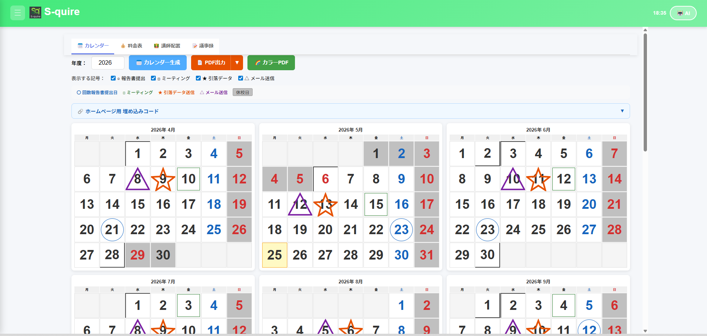
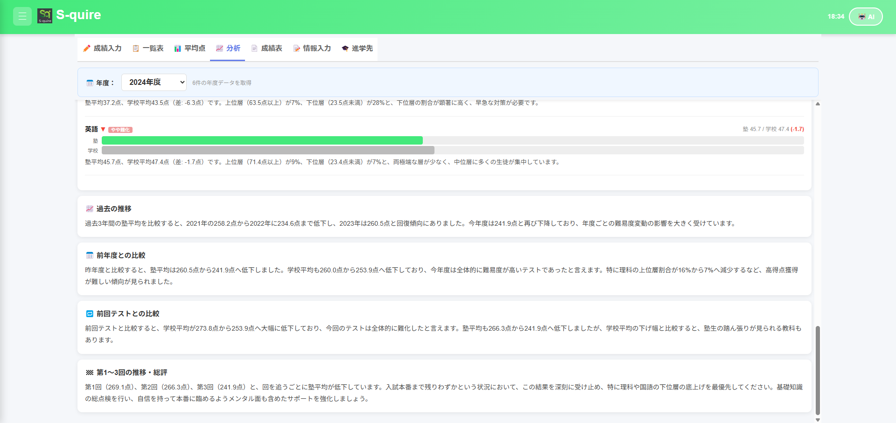
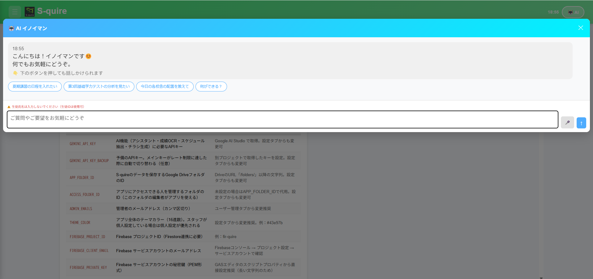
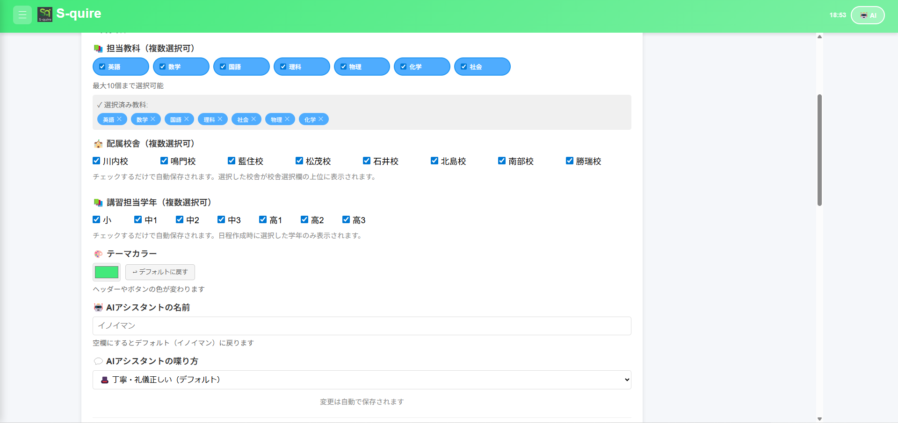
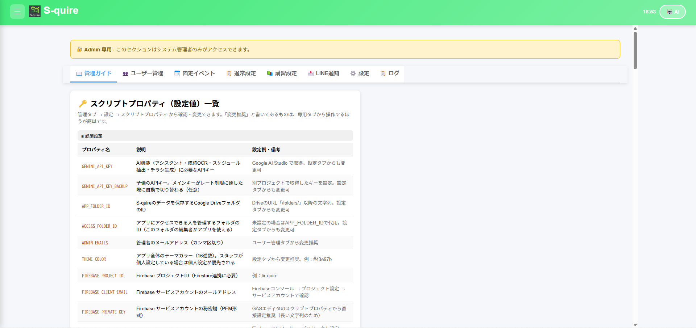

# S-quire

> 徳島県の学習塾「個別指導スクエア」のために、一人の講師がAIと作った業務管理システム。
> 8校舎のスタッフが日常業務で使用中。



---

## このリポジトリについて

このリポジトリは、AIコーディング業務の応募ポートフォリオとして公開しています。

実際に運用しているシステムをそのままお見せすることで、私が「何を作れるか」だけでなく「どう作っているか」「どう保守しているか」を確認していただけるようにしました。

機密情報は置換・除去済みですが、設計判断・運用記録・コードベースの規模感は加工せずそのままです。

> **※ 本番運用されているのは別アカウントの S-quire です。このリポジトリは公開用のコピーであり、応募ポートフォリオの提示に加えて、コード改善ルール検証の実験環境としても使用しています。実験開始前の本番準拠コードは Git タグ `baseline-20260526` から参照できます。**

---

## S-quireとは

徳島県で8校舎を展開する学習塾「個別指導スクエア」の業務管理システムです。8校舎のスタッフ全員が、年間スケジュール管理・成績管理・講習運営・保護者向け資料作成など、日々の業務で使用しています。

**主な機能：**
- **スケジュール管理** — 年間カレンダーの自動生成、各種PDF出力
- **成績管理** — 入力・一覧・平均点・塾内分析・生徒個別の成績表（AI分析付き）・進学先記録
- **講習管理** — 講習日程の登録、内部生向け申込用紙の自動作成、外部用チラシの半自動作成、講習関連のLINE通知
- **議事録管理** — 要約済みテキストの保存・検索
- **AIアシスタント「イノイマン」** — スタッフからの質問応答・業務操作の補助
- **LINE Messaging API連携** — スタッフ向け定型通知・引落データ送信リマインダー（保護者連絡には使用していません）



成績分析画面では、Gemini APIに過去複数年度のデータと当年度のデータを渡し、定量比較・傾向分析・改善提案までを一括で生成しています。同様に、**生徒個別の成績表にもAI分析を組み込み**、模試の偏差値を自動計算（複数校の平均点から標準偏差を推定する独自方式）、さらに過去の合格者データを元に**志望校への合格可能性をAIが分析**します。

---

## 開発者について

**猪井 真二（Shinji Inoi）** ／ GitHub: [@Inoi771](https://github.com/Inoi771)

徳島県在住。個別指導スクエア（8校舎）の一講師として勤務しています。

### これまでの内製の経緯

業務システムの内製は2024年初頭から取り組んでいます。

**2024年2月〜3月：Pythonで第1作を構築**

生徒の入退室管理・教科別の学習時間・総学習時間・通塾日数を記録するアプリを、2ヶ月かけて作りました。Renderにデプロイし、**2024年4月〜2026年3月まで2年間にわたって塾の現場で実運用**しました。

当時のAIは文脈長が短く、数ターンで会話の流れを忘れてしまうため、欲しい関数を一つひとつ依頼して、生成されたコードを自分で貼り合わせていく形でした。エラーや修正箇所も自分で見つけて、再度AIに尋ねながら直していました。Pythonコードを「読める」とまでは言えませんが、**処理の流れを追い、原因箇所の見当をつけてAIに正しく質問する経験**はこの時期に積みました。生徒・スタッフの利用減少とRenderの有料化を受け、2026年3月で運用を終了しています。

**2025年秋〜：S-quire を新規構築**

S-quire は前作とは別物の業務管理システムで、塾運営全体をカバーすることを目指して2025年秋に開発を始めました。当初はGitHubを使わず、Google Apps Scriptに直接コードを貼り付ける形でした。

**2026年3月〜：Claude Code導入で開発体制が一変**

Claude CodeでGitHub上のコードを直接読みながら作業できるようになり、**開発速度・修正速度・新機能追加のペースが劇的に上がりました。** リポジトリの規模が現在の水準（フロント26ファイル・バックエンド42ファイル（GAS 18 + Workers 24）・設計書17本）まで育ったのは、この体制移行が大きく寄与しています。

### このポートフォリオで伝えたいこと

コードの中身は分かりません。けれども、業務の現場感覚・「何を作るべきか」の判断・運用上の制約をすべて自分で握った上で、AIに方向づけを与え続ければ、これだけのシステムを一人で構築・運用できます。それを実証したのがこのリポジトリです。

副業として AIコーディング業務に応募するのは、このスキル（設計・判断・運用）が塾の外でも通用するかを確かめたいからです。「コードを書けるAIエンジニア」ではなく「**AIに何を書かせるかを決める人**」として、力になれる場所を探しています。

---

## 開発体制：設計と実装の分業

私（猪井 真二／@Inoi771）は**コードが書けません。読めません。**

その上でこのシステムを構築・運用しています。可能にしているのは、AIとの徹底した分業です。

| 役割 | 担当 |
|------|------|
| 何を作るか・なぜ作るか | 私（業務知識・現場感覚） |
| どう作るか・どう壊さないか | 私（設計判断・優先順位） |
| 設計書・ドキュメント文書化 | Claude（私との対話を元に） |
| 実装（コード生成） | Claude Code |
| 動作確認・本番運用 | 私 |

具体的には、claude.aiで設計や方針を固めてからClaude Codeに実装を依頼する**二刀流ワークフロー**を採用しています。各セッションで「何を」「どこに」「なぜ」を文書化してから実装に入るため、コードの中身が分からなくても、システム全体の方針はぶれません。

リポジトリ内に並ぶ17本の `.md` ファイル（設計書・コーディング規約・データ構造定義・移行記録など）は、いずれも**私との対話を元にAIが文章化したもの**です。何を書くか・どこまで決めるか・どの粒度で残すかは、すべて私が判断しています。「ドキュメントを書く」工程をAIに任せる代わりに、「設計の中身を決める」工程に私の時間を集中させる体制です。

応募先で求められる「AIに任せきりにせず、方向づけられる人」としての適性を、このリポジトリ全体でお見せします。

---

## 技術構成

```
[フロントエンド]                [バックエンド]                 [データ]
                           ┌──────────────────┐
 HTML/CSS/JavaScript       │  GAS Web App     │──► Google Spreadsheet
 (Firebase Hosting で      │  （API・Webhook） │
  配信／PWA対応)      ───►│                  │
        ▲                  │  ↓ 段階移行中     │
        │ gasApi POST      │                  │
        └──────────────────│  Cloudflare      │──► Firestore（イベント等）
                           │  Workers         │──► Supabase（生徒データ）
                           │  + KV Storage    │──► KV（設定・トークン）
                           └──────────────────┘
                                   │
                                   ├──► Gemini API（AI機能全般）
                                   ├──► LINE Messaging API（スタッフ通知）
                                   └──► Firebase Auth（認証）
```

**スタック：**

- **言語：** JavaScript（フロントエンド・GAS・Workers すべて）
- **フロントエンド：** Firebase Hosting で配信（SPA構成・PWA対応・ビルド時にHTMLパーシャルを結合）
- **バックエンド：** Google Apps Script（API・LINE Webhook担当）→ Cloudflare Workers（段階移行中・約6割完了）
- **データベース：** Google Spreadsheet（既存）・Firestore（イベント・SNS投稿予定）・Supabase PostgreSQL（生徒データ・RLS適用）
- **設定ストア：** Cloudflare KV
- **認証：** Firebase Auth（Googleアカウント・ホワイトリスト型）
- **AI：** Google Gemini API（用途に応じて軽量モデルを選定・予備APIキーへの自動切替で冗長化）
- **通知：** LINE Messaging API（スタッフ向けのみ）
- **CI/CD：** GitHub Actions（5本：GASデプロイ・Firebaseデプロイ・Workersデプロイ・自動マージ・構文チェック）



AIアシスタント「イノイマン」（私の名前「猪井」から命名）は、スタッフが自然言語で業務操作を依頼できるインターフェースです。喋り方や名前は各スタッフが個人設定で変更できます。

---

## 主な機能一覧

### 業務機能
- 年間カレンダー自動生成（休校日・引落データ送信日・ミーティング日を記号で表示）
- 年間講師配置の管理（年度初めに決定し年間固定・8校舎・複数学年・教科別）
- 成績管理（入力・一覧表・平均点・分析・成績表PDF・進学先記録）
- 内部生向け申込用紙の自動生成（A4 PDF・学年別レイアウト・自動フォントサイズ調整）
- 外部用チラシの半自動作成
- 議事録（AIで要約済みのテキストを貼り付けて保存・検索）
- 料金表管理・スタッフ配置管理

### AI機能
- AIアシスタント「イノイマン」（質問応答・操作補助・サジェストボタン）
- **成績の多角的分析** — 塾全体の過去年度比較・前回比較・科目別総評
- **生徒個別の成績表分析** — 一人ひとりの推移・強み弱みをAIが要約
- **偏差値の独自推定** — 複数校の平均点から標準偏差を推定し、模試偏差値を自動計算
- **志望校合格可能性のAI分析** — 過去の合格者データと現在の成績から合格可能性を提示
- OCR取り込み — 生徒の点数（手書き対応）・講習スケジュール（写真・PDF・テキスト貼付すべて対応）
- 自己学習型ナレッジベース

### 運用機能
- LINE通知（スタッフへの定型メッセージ・引落リマインダー）
- 個人別設定（担当教科・配属校舎・テーマカラー・AIアシスタント名・喋り方）
- スタッフホワイトリスト認証（Google OAuth・第三者ログイン不可）
- イースターエッグ（Konamiコマンド等）



個人設定画面では、各スタッフが担当教科・配属校舎・講習担当学年・テーマカラー・AIアシスタントの名前と喋り方を自由にカスタマイズできます。配属校舎の選択は校舎名一覧の並び順にも反映され、自分の校舎が常に上位に表示されます。

---

## 設計→実装のワークフロー — `SNS-DESIGN.md` を例に

**このREADMEで最もお見せしたい部分です。**

リポジトリには `SNS-DESIGN.md` という、Instagram連携機能の設計書があります。**まだ実装していない**機能の計画書です。

この設計書には以下が含まれています：

- **Phase分割** — 設計→前準備→トークン管理→Cron→LINE通知→Admin設定→投稿機能→予約投稿、と8段階に分解
- **無料運用の根拠** — Firebase Storage 5GB枠・Cloudflare Workers 100,000req/日枠など、全項目で無料枠との照合
- **データ構造の事前設計** — Firestoreの新規コレクション（フィールド名・型・用途）を実装前に確定
- **リスク管理** — Meta API仕様変更・App Review不承認・トークン期限切れなど、既知リスクと対策をテーブル化
- **既存資産との接続方針** — 「既存ファイル変更は最小限・新規追加が原則」というルールを明示
- **再現性** — 各Phase開始時にWeb検索で最新仕様を再確認するチェックリスト

**この設計書は、私とClaudeの対話から生まれたものです。** 私自身はコードを書けませんが、塾の業務知識・既存システムの構造・運用上の制約をすべて頭に入れた上で、AIと議論しながらこの粒度まで落とし込んでいます。文章化はAIが担いますが、Phase分割の判断、無料運用の選択、優先順位の決定は私の仕事です。

応募先で求められるのは「AIに何を作らせるかを決められる人」ではないでしょうか。`SNS-DESIGN.md` は、私がその役割を担えることの最も明確な証拠です。

---

## システム規模

| 項目 | 数 |
|---|---|
| バックエンド（GAS）| 18 ファイル |
| バックエンド（Cloudflare Workers）| 24 ファイル |
| フロントエンド（HTML/JS）| 26 ファイル |
| テストファイル（Jest）| 12 ファイル |
| 設計ドキュメント（.md）| 17 ファイル |
| 移行記録（docs/）| 15 ファイル |
| CI/CDワークフロー（GitHub Actions）| 5 ファイル |
| **合計** | **約120ファイル** |

主要な設計ドキュメント（いずれも私との対話を元にAIが文書化）：

| ファイル | 内容 |
|---|---|
| `CLAUDE.md` | プロジェクト全体設計書（Claude自動読込・コーディング規約・タブ構成等） |
| `DATA.md` | データ構造・スキーマ定義 |
| `DESIGN.md` | 設計判断・制約事項の記録 |
| `BUGS.md` | 既知バグ・ブラックリスト |
| `CODING.md` | コーディング規約 |
| `DEPLOY.md` | デプロイ設定・手順 |
| `FUNCTIONS-frontend.md` / `FUNCTIONS-backend.md` | 全関数リスト |
| `SNS-DESIGN.md` | 未実装機能の設計書（上記参照） |
| `docs/migration-plan.md` | Workers移行全体計画 |
| `docs/phase-*.md`（15本） | フェーズ別移行記録 |

---

## 技術的判断の記録

このシステムは2025年秋から段階的に進化させてきました。主要な判断を記録しています。

**GAS → Cloudflare Workers 移行（進行中・約6割完了）**

GAS は導入が容易ですが、実行時間制限（6分）・並列実行数制限・外部API呼び出し制限などのスケーラビリティ課題があります。Phase 5〜6 で機能ごとに段階的にCloudflare Workersへ移行中です（約6割完了）。移行記録は `docs/phase-*.md` 15本に詳細に残しています。

**Firestore → Supabase 移行（生徒データのみ）**

Firestore の無料枠（読み取り50,000/日）が、生徒検索の高頻度利用で逼迫したため、生徒データのみPostgreSQL（Supabase）に移行。RLS（Row Level Security）でアクセス制御しています。イベント系データは引き続きFirestore。

**ScriptProperties → Cloudflare KV 移行**

GAS の ScriptProperties は GAS 実行コンテキスト内でしか参照できないため、Workers から共通で参照できる Cloudflare KV へ移行。

**Gemini モデル選定とコスト管理**

無料枠で運用可能な軽量モデルを採用しています。レート制限到達時には予備APIキーへ自動切替する冗長構成。モデルの提供終了や無料枠変更にも対応できるよう、モデル名は設定値として切り出してあります。

**学校スケジュールPDF取り込みの方針変更**

当初はAIで学校配布のPDFから日程を抽出して取り込む機能を試しましたが、運用してみると使い勝手が悪く、現場での確認・修正の手間がかえって増えたため、**手動入力に戻す判断をしました**。AI機能を増やすこと自体が目的ではなく、現場で使いやすいことを優先しています。



Admin設定画面では、スクリプトプロパティ・各種API認証情報・LINE通知設定などを一元管理しています。各設定項目には用途・取得元・変更推奨経路が明記されており、将来の引き継ぎを意識した運用ドキュメント性を持たせています。

---

## 連絡先

このリポジトリは Private で運用しています。応募時に GitHub の Collaborator として招待することで、応募先の方に内容を共有します。

ご連絡は応募経路からお願いします。
